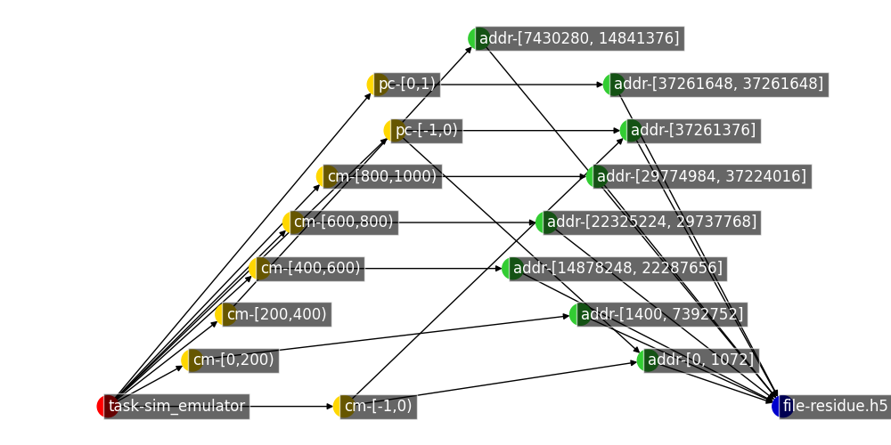

# Sankey Diagram of Workflow Traces
Traces are generaged by using HDF5 passthrough-VOL and Hermes VFD adaptor. Recorded as log files, then being transformed into csv files for analysis.\
Logging process shell be improved in the future.

## Producer-Consumer
The producer and consumer program is the sim_emulator.py and aggregator.py programs. Simplified as SIM and AGG below.

## List of Sankey Graphs
### Detailed Graphs 
Located in the ./detailed_graph folder:
- [Sampled detailed SIM](https://htmlpreview.github.io/?https://github.com/candiceT233/local-co-scheduling/blob/sankey-graph/sankey_diagram/detailed_graph/sankey-sampled-sim_w-vol-vfd-.html)
- [Sampled detailed AGG](https://htmlpreview.github.io/?https://github.com/candiceT233/local-co-scheduling/blob/sankey-graph/sankey_diagram/detailed_graph/sankey-sampled-agg-vol-vfd.html)
    - Note that the aggregation workflow, the task-aggregator node is not respecting the assigned [x,y] position of the graph
- [Sampled detailed SIM-AGG](https://htmlpreview.github.io/?https://github.com/candiceT233/local-co-scheduling/blob/sankey-graph/sankey_diagram/detailed_graph/sankey-sampled-agg-vol-vfd.html)

### Grouped Graphs
These are graphs grouping the small I/O accesses into larger groups. \
Located in the ./group_graph folder:
- [Grouped SIM](https://htmlpreview.github.io/?https://github.com/candiceT233/local-co-scheduling/blob/sankey-graph/sankey_diagram/group_graph/sankey-grouped-sim-vol-vfd-.html)
- [Grouped AGG](https://htmlpreview.github.io/?https://github.com/candiceT233/local-co-scheduling/blob/sankey-graph/sankey_diagram/group_graph/sankey-grouped-agg-vol-vfd.html)
    - Note that the aggregation workflow, the task-aggregator node is not respecting the assigned [x,y] position of the graph
- [Grouped SIM-AGG](https://htmlpreview.github.io/?https://github.com/candiceT233/local-co-scheduling/blob/sankey-graph/sankey_diagram/group_graph/sankey-grouped-sim_agg-vol-vfd.html)

### Notation Explained

The sim_emulator.py (represented as task-sim_emulator in red) writes two datasets, contact map (cm) and point cloud (pc).

### Note
Prefix this linke `https://htmlpreview.github.io/?` to view HTML on GitHub.